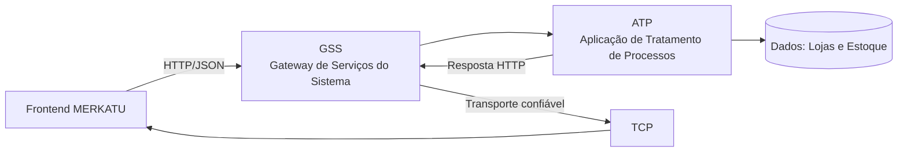
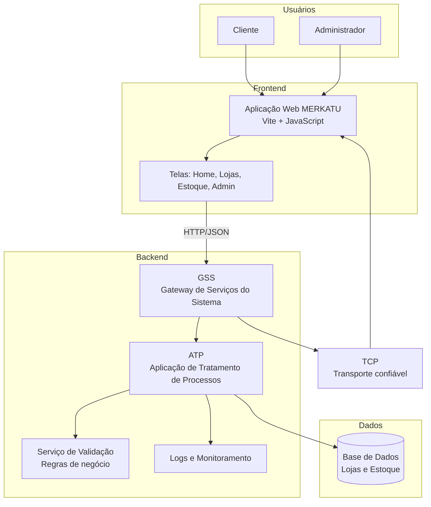
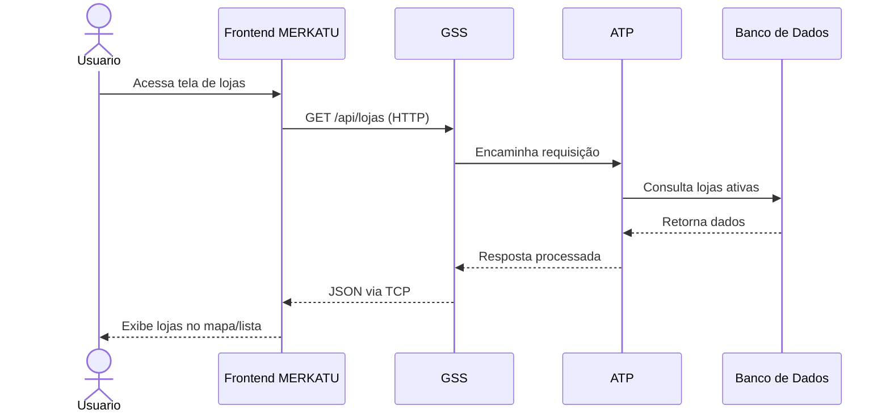

# 🏪 MERKATU - Plataforma de Lojas Online

Uma plataforma moderna e completa para gerenciamento de lojas físicas e virtuais com controle centralizado de estoque, geolocalização de lojas e painel administrativo intuitivo.

## 🎯 Funcionalidades

### Para Clientes
- ✅ **Home Page Atraente** - Apresentação da marca MERKATU
- ✅ **Catálogo de Lojas** - Visualizar todas as lojas com informações de contato
- ✅ **Localização de Lojas** - Ver lojas no mapa com coordenadas GPS
- ✅ **Busca e Filtros** - Encontrar lojas por nome e proximidade
- ✅ **Consulta de Estoque** - Verificar disponibilidade de produtos por loja

### Para Administradores
- ✅ **Painel Administrativo Completo** - Gerenciar todos os aspectos do negócio
- ✅ **Gerenciamento de Lojas** - Adicionar, editar e deletar lojas
- ✅ **Mapa Interativo** - Marcar localização das lojas pelo mapa
- ✅ **Controle de Estoque** - Gerenciar quantidade, preço e status de produtos
- ✅ **Analytics em Tempo Real** - Estatísticas de lojas, produtos e estoque
- ✅ **Alertas de Estoque** - Identificar produtos com estoque baixo

### Tecnologia
- ✅ **Frontend Moderno** - Vite + JavaScript Vanilla
- ✅ **Backend RESTful** - Node.js + Express
- ✅ **Roteamento Dinâmico** - Navegação entre múltiplas páginas
- ✅ **API Geolocalização** - Encontrar lojas próximas
- ✅ **Design Responsivo** - Funciona em desktop, tablet e mobile

## 📁 Estrutura do Projeto

```
merkatu-lojas/
├── index.html                 # Página principal
├── package.json              # Dependências
├── vite.config.js           # Configuração Vite
├── api/
│   └── server.js            # Backend API (Node.js + Express)
└── src/
    ├── main.js              # Lógica principal e roteamento
    ├── components/
    │   ├── header.js
    │   └── footer.js
    ├── pages/
    │   ├── home.html        # Página inicial
    │   ├── lojas.html       # Listagem de lojas
    │   ├── estoque.html     # Gerenciador de estoque
    │   ├── admin.html       # Painel administrativo
    │   └── sobre.html       # Sobre a marca
    ├── data/
    │   ├── config.json
    │   └── sample.json
    └── styles/
        └── main.css         # Estilos globais
```

## 🚀 Como Começar

### Pré-requisitos
- Node.js 16+
- npm ou yarn

### Instalação

1. **Clone ou navegue até o projeto:**
```bash
cd c:\Users\Alessandro\OneDrive\Desktop\ideia\vite-json-html-starter
```

2. **Instale as dependências:**
```bash
npm install
```

### Desenvolvimento

**Terminal 1 - Iniciar Frontend (Vite):**
```bash
npm run dev
```
Acesse em: http://localhost:3000

**Terminal 2 - Iniciar Backend (API):**
```bash
npm run api
```
API disponível em: http://localhost:3001

## 📚 Páginas da Aplicação

### 🏠 Home (`/`)
- Apresentação da marca MERKATU
- Destaque dos principais recursos
- Call-to-action para explorar lojas

### 🏪 Lojas (`/lojas`)
- Listagem de todas as lojas
- Mapa interativo com localização
- Busca e filtros
- Informações de contato

### 📦 Estoque (`/estoque`)
- Tabela com todos os produtos
- Filtros por loja e produto
- Status de estoque (OK, Baixo, Crítico)
- Ações para editar/deletar produtos

### ⚙️ Admin (`/admin`)
**Tabs:**
- **Gerenciar Lojas** - CRUD de lojas + Mapa
- **Estoque** - Gerenciador de produtos
- **Analíticas** - Estatísticas do negócio

### ℹ️ Sobre (`/sobre`)
- Informações sobre MERKATU
- Recursos e tecnologia
- Contato

## 🔌 API Endpoints

### Lojas
```
GET    /api/lojas              # Todas as lojas
GET    /api/lojas/:id          # Loja específica
POST   /api/lojas              # Criar loja
PUT    /api/lojas/:id          # Atualizar loja
DELETE /api/lojas/:id          # Deletar loja
```

### Estoque
```
GET    /api/estoque            # Todo o estoque
GET    /api/estoque/loja/:loja # Estoque por loja
POST   /api/estoque            # Adicionar produto
PUT    /api/estoque/:id        # Atualizar produto
DELETE /api/estoque/:id        # Deletar produto
```

### Geolocalização
```
GET    /api/lojas/proxima/:lat/:lng  # Loja mais próxima
```

### Outros
```
GET    /api/analytics          # Estatísticas gerais
GET    /api/health             # Status da API
```

## 🧩 Diagrama (GSS, ATP e TCP)

Para o seu trabalho, você pode apresentar a arquitetura em 3 blocos:

- **GSS (Gateway de Serviços do Sistema)**: camada de entrada que recebe as requisições do frontend.
- **ATP (Aplicação de Tratamento de Processos)**: camada de regra de negócio (lojas, estoque, validações).
- **TCP (Transmission Control Protocol)**: camada de transporte confiável da comunicação em rede.

### Fluxo resumido

1. Frontend envia requisição HTTP
2. Requisição chega no **GSS**
3. **GSS** encaminha para **ATP**
4. **ATP** processa e responde
5. Resposta retorna via **TCP** ao frontend

### Diagrama Mermaid



> Se o seu professor usar outro significado para as siglas GSS/ATP, basta trocar os nomes mantendo o mesmo fluxo do diagrama.

### ✅ O que mais colocar no diagrama (além de GSS, ATP e TCP)

Para deixar seu trabalho mais completo, inclua também:

- **Atores**: Cliente, Administrador
- **Canais**: Navegador Web e API REST
- **Segurança**: Validação de entrada e CORS
- **Dados**: Coleções de Lojas e Estoque
- **Serviços de suporte**: Logs e Monitoramento
- **Infraestrutura**: Frontend (Vite) e Backend (Node.js/Express)

### Diagrama de Componentes (mais completo)



### Diagrama de Sequência (para explicar o funcionamento)



### Dica para apresentar

Use o **diagrama de componentes** para mostrar estrutura e o **diagrama de sequência** para mostrar o passo a passo de uma operação.

## 🎨 Design e Estilo

- **Cores Principais**: Violeta (#667eea) e Laranja (#f59e0b)
- **Tipografia**: Segoe UI, Verdana, sans-serif
- **Layout Responsivo**: Mobile-first design
- **Animações**: Transições suaves e hover effects

## 💾 Dados de Exemplo

O projeto inclui 3 lojas de exemplo:
1. **MERKATU Centro** - Rua Principal, 123
2. **MERKATU Zona Sul** - Av. Paulista, 1000
3. **MERKATU Zona Norte** - Rua do Comércio, 500

E 5 produtos em diferentes lojas para teste.

## 🔒 Segurança

- CORS habilitado para comunicação frontend-backend
- Dados armazenados em memória (pronto para integração com BD)
- Validação de entrada em API endpoints

## 🚢 Deploy

### Frontend (Vite)
```bash
npm run build
# Gera arquivo em dist/
```

### Backend
Pode ser hospedado em:
- Heroku
- Railway
- DigitalOcean
- AWS Lambda

## 📦 Dependências

- **express** - Framework backend
- **cors** - Política de CORS
- **uuid** - Geração de IDs únicos
- **vite** - Build tool frontend

## 🤝 Contribuições

Sinta-se livre para adicionar novas funcionalidades:
- [ ] Integração com BD (MongoDB, PostgreSQL)
- [ ] Autenticação e login
- [ ] Integração com Stripe (pagamentos)
- [ ] Notificações em tempo real (WebSocket)
- [ ] Upload de imagens de produtos
- [ ] Sistema de avaliações

## 📞 Contato

**MERKATU**
- 📧 Email: contato@merkatu.com
- 📞 Telefone: (11) 9999-9999
- 🌐 Website: www.merkatu.com

## 📝 Licença

MIT

---

**Desenvolvido com ❤️ para MERKATU - 2026**
